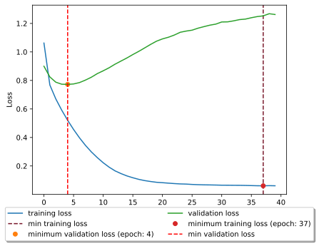
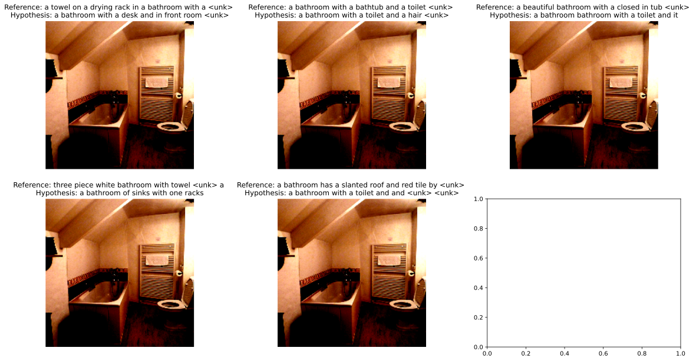

## OCOM5203M Assignment 1 - Image Caption Generation

### Dataset
A **subset** of the COCO 2014 dataset was used for this assignment. The dataset can be downloaded from [here](http://cocodataset.org/#download). The dataset is split into 3 parts: train, validation and test. The train and validation sets are used for training the model and the test set is used for evaluating the model. 

### Performance

> Sample with high **BLEU** score (100.00):
**Predicted**: a little girls are playing with a hair dryer
**True**: ['two toddlers are playing with a hair driver ', 'a couple of little girls standing next to each other ', 'two little girls who have a hair dryer ', 'two young children standing in a room while one plays with a hair dryer ', 'two little girls are playing with a hair dryer in a library room ']

> Sample with low **BLEU** score (7.94):
**Predicted**: a kites and on on a "\<unk>\" of
**True**: ['colorful opened umbrellas are arranged outside of the store windows ', 'a bunch of umbrellas are in front of a house', 'a bunch of umbrellas are opened next to each other ', 'many umbrellas sitting open against the side of a building ', 'large group of colorful umbrellas sitting next to each other ']

> Sample with high **cosine similarity** score (20.00):
Predicted: a man sitting a table and a woman sitting a "\<unk>\" "\<unk>\"
True: ['a young man sitting with a laptop computer on his lap ', 'a man playing a video game as his friend looks at a laptop screen', 'a guy on a laptop and a guy holding a wii remote ', 'a guy is playing wii with his friend ', 'a man is playing a video game while his friend is on his laptop ']

> Sample with low **cosine similarity** score (-22.39):
Predicted: a white cake and a cup on to be
True: ['a white plate with a brownie and white frosting ', 'a piece of chocolate cake on top of a white plate ', 'a chocolate cake and a fork ready to be eat', 'a chocolate desert on a plate with a fork ', 'a piece of chocolate dessert on a plate with a napkin and a fork ']

[notebook](OCOMP5203M_A1.ipynb)